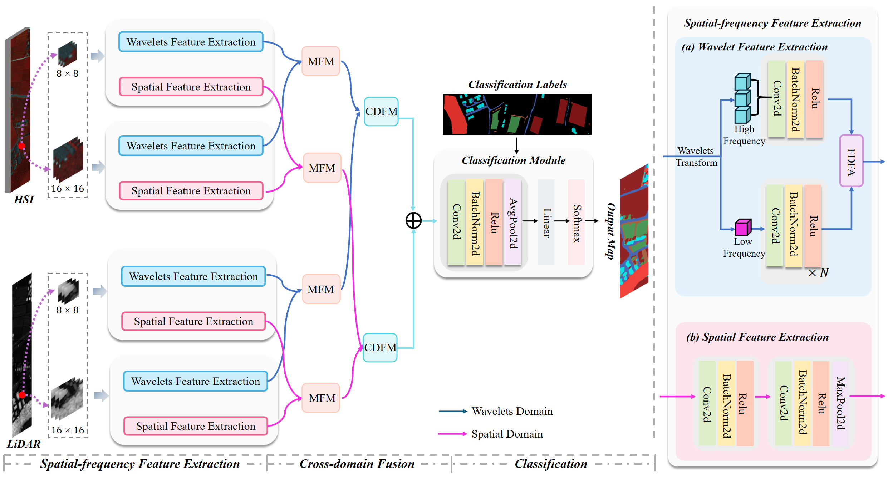

# Data and Code for MCFNet

    

## 👉 Data

## Getting Started

### 🍀: Environment Setup:

To get started, we recommend setting up a conda environment and installing dependencies via pip. Use the following commands to set up your environment

conda create -n mcfnet python==3.11

conda activate mcfnet

pip install -r requirements.txt

pip install PyWavelets

### 🌸: Run
python demo.py

### 🌿: Citation

## Acknowledgment

This code is mainly built upon [GLT](https://github.com/Ding-Kexin/IEEE_TGRS_GLT-Net) and [FDNet](https://github.com/RSIP-NJUPT/FDNet.git) repositories.

